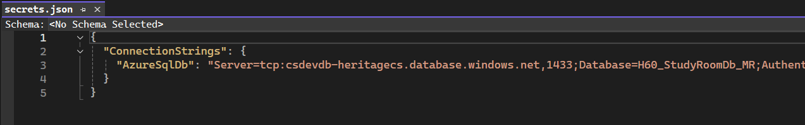

# Getting Started

1. After cloning the project, make sure you create the database in azure (or locally, I don't think it matters as long as one person has the database in the cloud to show Gil)
2. Run the SQL script included in the repo on YOUR database.
3. Add your connection string to the project user secrets.
   1. Right click project
   2. User Secrets
   3. 
   4. Same connection string as the one in the appsettings (commented out now). Just make sure to replace with your database's connection information.
4. Run "Update Database" in the Package Manager Console (the migration was already created by Eishi in an earlier commit)
5. Everything should run as expected.

Not trying to step on anyone's toes doing this, just trying to make the project easier to collaborate on, because nobody likes merge conflicts :)

Hope this is helpful.

Miguel

